# 🌿 Laboratory Work 2-A Activity — Plant Species Image Classification Using Teachable Machine

---

## A. Project Overview

### 📋 Description of the Project
This project focuses on creating an image classification model capable of recognizing **20 different types of Coleus varieties**. Using Google's Teachable Machine, we collected and organized images of various Coleus varieties (genus *Plectranthus scutellarioides*) to train and test the model's accuracy in identifying each unique plant species based on their distinct leaf patterns, colors, and shapes.

---

### 🎯 Purpose of the Image Classification Model
This project uses image classification to distinguish between different Coleus varieties by analyzing their leaf patterns and colors. It demonstrates how **Artificial Intelligence (AI)** can simplify plant identification, support botanical research, and serve as a practical tool for gardeners, botanists, and researchers who need a fast and reliable way to identify plant species.

---

## B. Plant Species Section

<table>
  <tr>
    <td align="center" width="25%">
      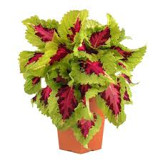 
      <b>1. Kong Rose Coleus</b> 
      <i>Plectranthus scutellarioides 'Kong Rose'</i> 
      Large-leafed variety with stunning rose-pink center surrounded by deep green or burgundy edges. Thrives in shaded to partially shaded environments.
    </td>
    <td align="center" width="25%">
      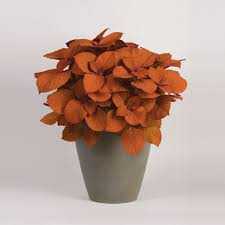 
      <b>2. Campfire Coleus</b> 
      <i>Plectranthus scutellarioides 'Campfire'</i> 
      Vibrant orange, red, and yellow leaves resembling flickering flames. Sun-tolerant variety popular for bright outdoor garden beds.
    </td>
    <td align="center" width="25%">
      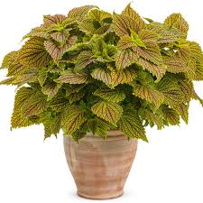 
      <b>3. Golden Dream Coleus</b> 
      <i>Plectranthus scutellarioides 'Golden Dream'</i> 
      Bright golden-yellow leaves with light green edges. Grows best in partial shade and adds a warm sunny tone to garden landscapes.
    </td>
    <td align="center" width="25%">
      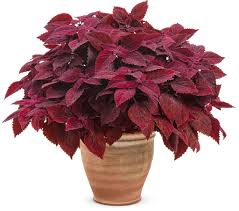 
      <b>4. Rediculous Coleus</b> 
      <i>Plectranthus scutellarioides 'Rediculous'</i> 
      Bold, vivid red and pink foliage with contrasting edges. A standout ornamental plant in both indoor and outdoor settings.
    </td>
  </tr>
  <tr>
    <td align="center" width="25%">
      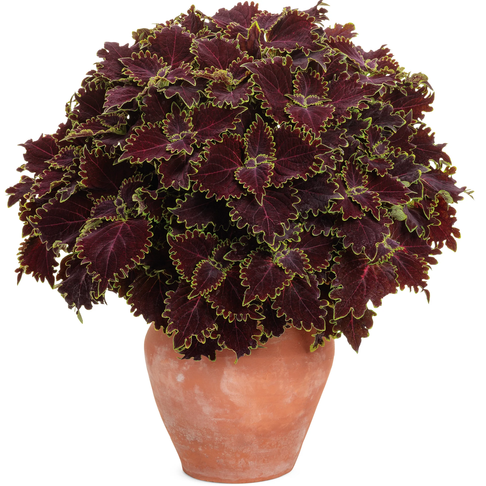 
      <b>5. Wicked Witch Coleus</b> 
      <i>Plectranthus scutellarioides 'Wicked Witch'</i> 
      Deep burgundy to almost black leaves with ruffled, serrated edges. Popular for Halloween-themed or gothic-style gardens.
    </td>
    <td align="center" width="25%">
      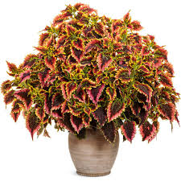 
      <b>6. El Brighto Coleus</b> 
      <i>Plectranthus scutellarioides 'El Brighto'</i> 
      Brilliantly bright multi-colored leaves in shades of yellow, green, and red. Thrives in partially shaded garden spots.
    </td>
    <td align="center" width="25%">
      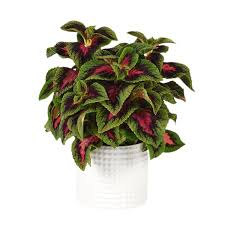 
      <b>7. French Quarter Coleus</b> 
      <i>Plectranthus scutellarioides 'French Quarter'</i> 
      Uniquely shaped deeply lobed leaves with rich color combinations of purple, green, and cream. Adds a lush tropical feel.
    </td>
    <td align="center" width="25%">
       
      <b>8. Trusty Rusty Coleus</b> 
      <i>Plectranthus scutellarioides 'Trusty Rusty'</i> 
      Warm rusty-brown and copper-toned foliage with subtle green undertones. Versatile for natural or rustic garden themes.
    </td>
  </tr>
  <tr>
    <td align="center" width="25%">
       
      <b>9. Wizard Jade Coleus</b> 
      <i>Plectranthus scutellarioides 'Wizard Jade'</i> 
      Soft jade-green leaves with creamy white centers and delicate pink accents. Part of the easy-to-grow Wizard series.
    </td>
    <td align="center" width="25%">
      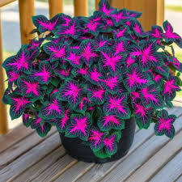 
      <b>10. Black Dragon Coleus</b> 
      <i>Plectranthus scutellarioides 'Black Dragon'</i> 
      Almost entirely dark maroon to near-black leaves with a velvety texture. Creates bold contrast when paired with lighter plants.
    </td>
    <td align="center" width="25%">
      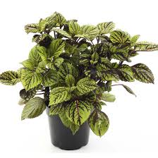 
      <b>11. Fishnet Stockings Coleus</b> 
      <i>Plectranthus scutellarioides 'Fishnet Stockings'</i> 
      Intricate dark veining over light green leaf surface resembling a fishnet pattern. An eye-catching conversation piece in any garden.
    </td>
    <td align="center" width="25%">
      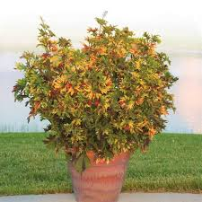 
      <b>12. Twist and Twirl Coleus</b> 
      <i>Plectranthus scutellarioides 'Twist and Twirl'</i> 
      Uniquely curled and twisted leaf edges with a mix of red, green, and gold. A whimsical decorative standout in pots and borders.
    </td>
  </tr>
  <tr>
    <td align="center" width="25%">
      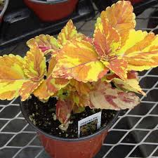 
      <b>13. Reckless Coleus</b> 
      <i>Plectranthus scutellarioides 'Reckless'</i> 
      Bold high-contrast foliage in vivid shades of red and yellow-green. Untamed energetic appearance that adds vibrancy to garden displays.
    </td>
    <td align="center" width="25%">
      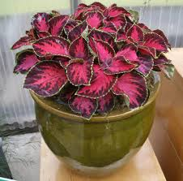 
      <b>14. Chocolate Covered Cherry</b> 
      <i>Plectranthus scutellarioides 'Chocolate Covered Cherry'</i> 
      Deep chocolate-brown leaves with bright cherry-red centers. Adds a rich dessert-inspired palette to ornamental gardens.
    </td>
    <td align="center" width="25%">
      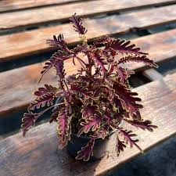 
      <b>15. Stained Glassworks Kiwi</b> 
      <i>Plectranthus scutellarioides 'Stained Glassworks Kiwi'</i> 
      Stunning mosaic of lime green, yellow, and red resembling stained glass art. Sun-tolerant and ideal for bright colorful displays.
    </td>
    <td align="center" width="25%">
      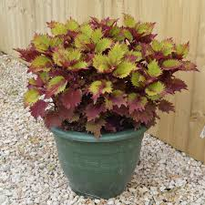 
      <b>16. Henna Coleus</b> 
      <i>Plectranthus scutellarioides 'Henna'</i> 
      Deeply cut fern-like leaves in warm shades of copper, orange, and brown. Exotic artistic appearance reminiscent of henna art patterns.
    </td>
  </tr>
  <tr>
    <td align="center" width="25%">
      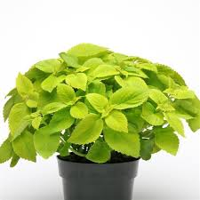 
      <b>17. Lime Coleus</b> 
      <i>Plectranthus scutellarioides 'Lime'</i> 
      Bright and cheerful uniform vivid lime-green foliage. Excellent contrast plant when paired with darker or more colorful varieties.
    </td>
    <td align="center" width="25%">
      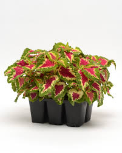 
      <b>18. Wizard Rose Coleus</b> 
      <i>Plectranthus scutellarioides 'Wizard Rose'</i> 
      Soft rose-pink centers with green-edged leaves. Part of the easy-to-grow Wizard series, well-suited for beginner gardeners.
    </td>
    <td align="center" width="25%">
      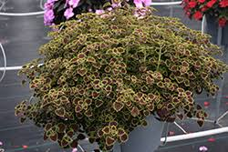 
      <b>19. Burgundy Wedding Train</b> 
      <i>Plectranthus scutellarioides 'Burgundy Wedding Train'</i> 
      Long trailing burgundy leaves with ruffled edges. Ideal for hanging baskets with a formal sophisticated look for decorative arrangements.
    </td>
    <td align="center" width="25%">
      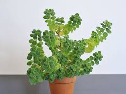 
      <b>20. Cuban Oregano</b> 
      <i>Coleus amboinicus</i> 
      Succulent-like herb with thick fleshy aromatic leaves used in cooking and traditional medicine. Strong oregano-like scent used across Southeast Asia.
    </td>
  </tr>
</table>

---

## C. Model Training Details

| Parameter | Value |
|-----------|-------|
| **Epochs** | 100 |
| **Batch Size** | 16 |
| **Learning Rate** | 0.001 |
| **Number of Images per Class** | 250–786 images |

### Training Settings Screenshot

  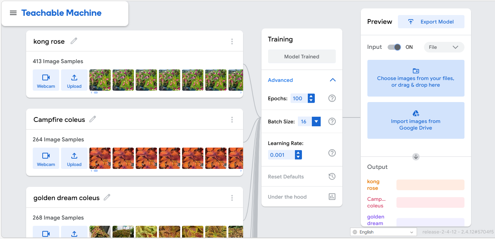 
  Teachable Machine Training Configuration — Epochs: 100, Batch Size: 16, Learning Rate: 0.001

### Why These Values?
- **Epochs: 100** — Enough iterations to allow the model to fully learn the distinct leaf patterns and colors of all 20 Coleus varieties without underfitting.
- **Batch Size: 16** — A small batch size that provides stable gradient updates and works well with the dataset size.
- **Learning Rate: 0.001** — A standard learning rate that ensures steady convergence without overshooting the optimal weights.

---

## D. Model Evaluation

### 📊 Confusion Matrix

  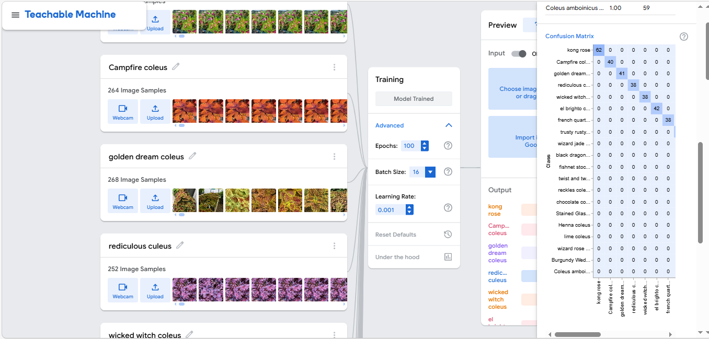 
  Confusion Matrix — showing predicted vs actual classes across all 20 Coleus varieties

### 🎯 Accuracy per Class

  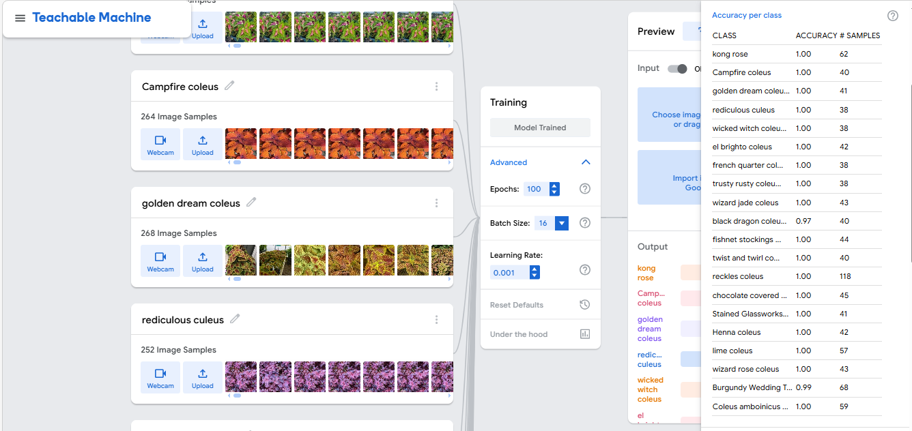 
  Accuracy per Class — most classes achieved 1.00 accuracy

### ✅ Overall Model Accuracy

  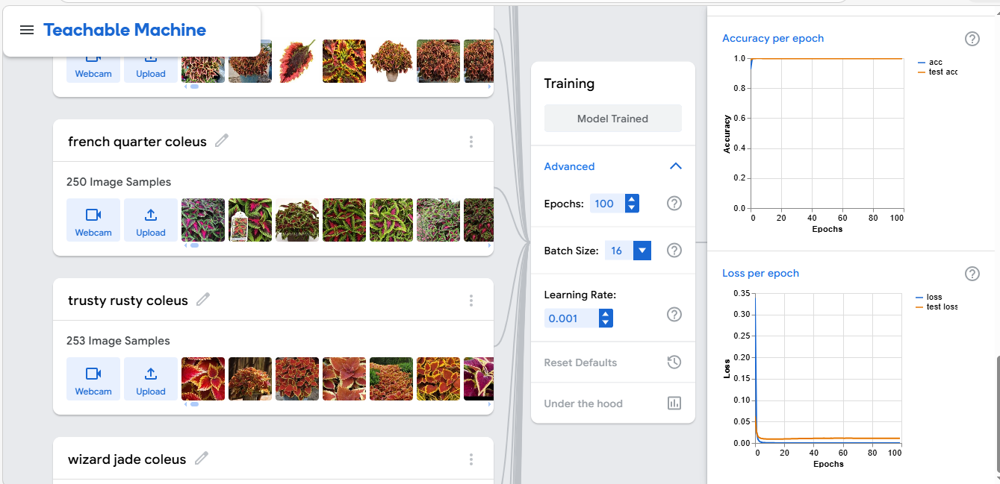 
  Overall Model Accuracy and Loss per Epoch

| Class | Accuracy | Samples |
|-------|----------|---------|
| Kong Rose | 1.00 | 62 |
| Campfire Coleus | 1.00 | 40 |
| Golden Dream Coleus | 1.00 | 41 |
| Rediculous Coleus | 1.00 | 38 |
| Wicked Witch Coleus | 1.00 | 38 |
| El Brighto Coleus | 1.00 | 42 |
| French Quarter Coleus | 1.00 | 38 |
| Trusty Rusty Coleus | 1.00 | 38 |
| Wizard Jade Coleus | 1.00 | 43 |
| Black Dragon Coleus | 0.97 | 40 |
| Fishnet Stockings Coleus | 1.00 | 44 |
| Twist and Twirl Coleus | 1.00 | 40 |
| Reckless Coleus | 1.00 | 118 |
| Chocolate Covered Cherry | 1.00 | 45 |
| Stained Glassworks Kiwi | 1.00 | 41 |
| Henna Coleus | 1.00 | 42 |
| Lime Coleus | 1.00 | 57 |
| Wizard Rose Coleus | 1.00 | 43 |
| Burgundy Wedding Train | 0.99 | 68 |
| Coleus amboinicus | 1.00 | 59 |

---

## E. Model Testing

> 18 testing screenshots were performed using the Preview section of Teachable Machine, testing each of the 20 Coleus varieties with real images.

<table>
  <tr>
    <td align="center" width="50%">
      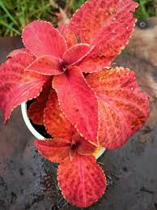 
      <b>Test 1 — Campfire Coleus</b> 
      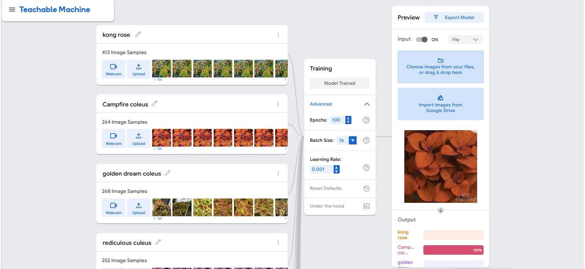 
      ✅ Predicted: Campfire Coleus | Confidence: 100%
    </td>
    <td align="center" width="50%">
      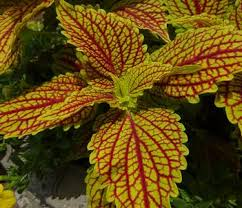 
      <b>Test 2 — Golden Dream Coleus</b> 
      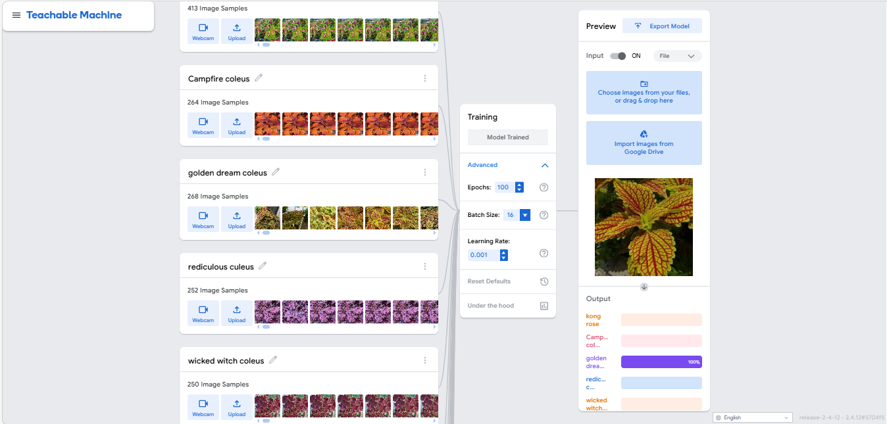 
      ✅ Predicted: Golden Dream Coleus | Confidence: 100%
    </td>
  </tr>
  <tr>
    <td align="center" width="50%">
      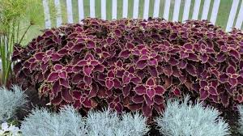 
      <b>Test 3 — Wicked Witch Coleus</b> 
      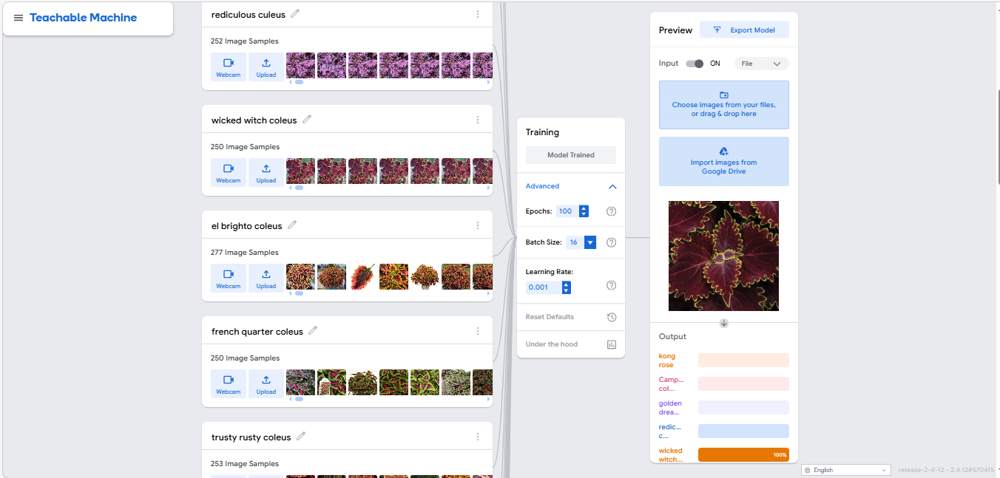 
      ✅ Predicted: Wicked Witch Coleus | Confidence: 100%
    </td>
    <td align="center" width="50%">
      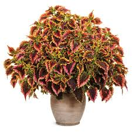 
      <b>Test 4 — El Brighto Coleus</b> 
      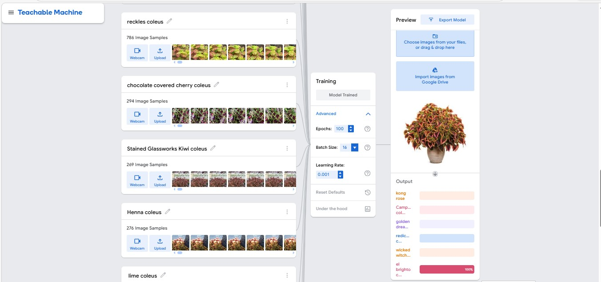 
      ✅ Predicted: El Brighto Coleus | Confidence: 100%
    </td>
  </tr>
  <tr>
    <td align="center" width="50%">
      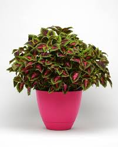 
      <b>Test 5 — French Quarter Coleus</b> 
      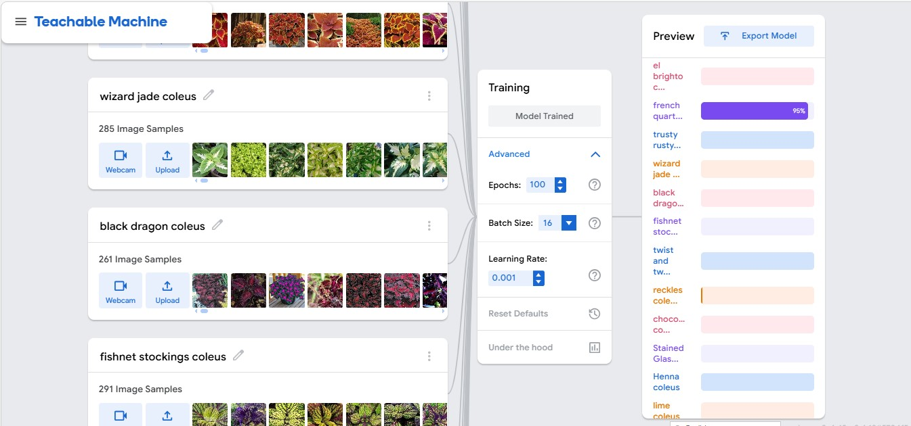 
      ✅ Predicted: French Quarter Coleus | Confidence: 95%
    </td>
    <td align="center" width="50%">
      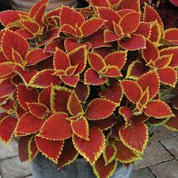 
      <b>Test 6 — Trusty Rusty Coleus</b> 
      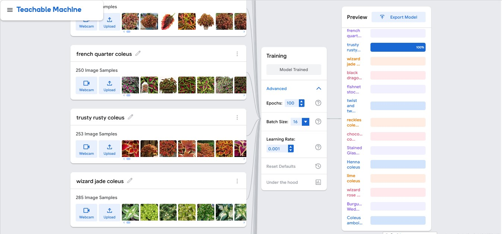 
      ✅ Predicted: Trusty Rusty Coleus | Confidence: 100%
    </td>
  </tr>
  <tr>
    <td align="center" width="50%">
      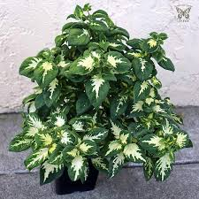 
      <b>Test 7 — Wizard Jade Coleus</b> 
      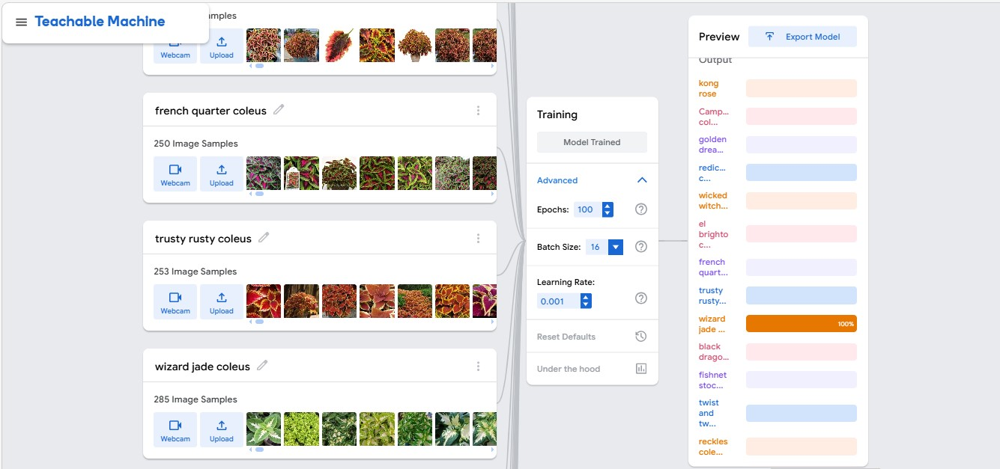 
      ✅ Predicted: Wizard Jade Coleus | Confidence: 100%
    </td>
    <td align="center" width="50%">
      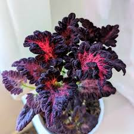 
      <b>Test 8 — Black Dragon Coleus</b> 
      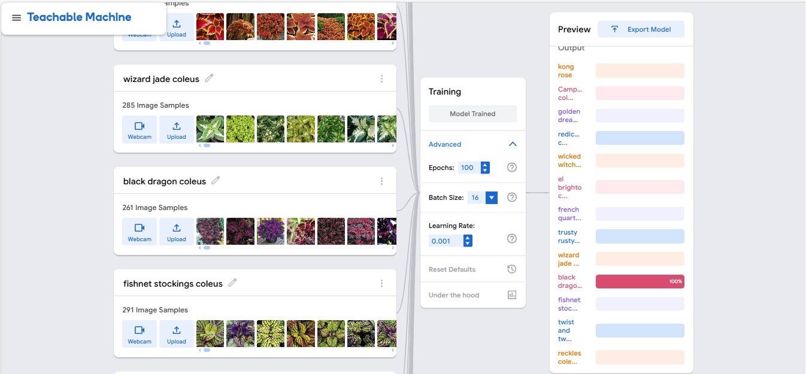 
      ✅ Predicted: Black Dragon Coleus | Confidence: 100%
    </td>
  </tr>
  <tr>
    <td align="center" width="50%">
      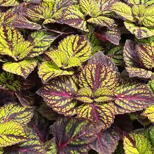 
      <b>Test 9 — Fishnet Stockings Coleus</b> 
      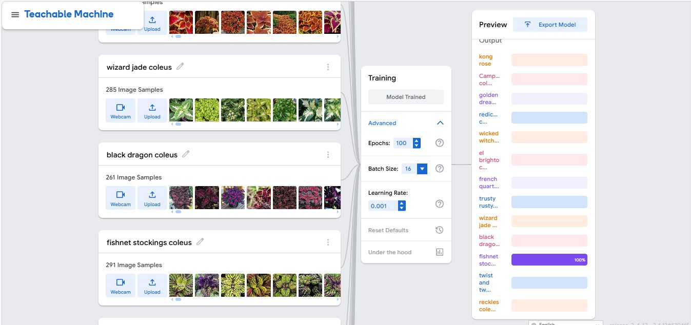 
      ✅ Predicted: Fishnet Stockings Coleus | Confidence: 100%
    </td>
    <td align="center" width="50%">
      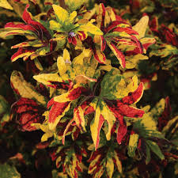 
      <b>Test 10 — Twist and Twirl Coleus</b> 
      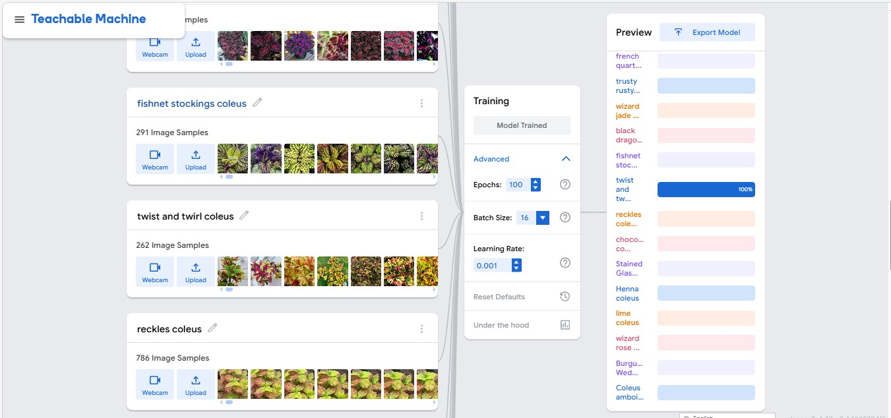 
      ✅ Predicted: Twist and Twirl Coleus | Confidence: 100%
    </td>
  </tr>
  <tr>
    <td align="center" width="50%">
      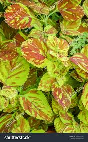 
      <b>Test 11 — Reckless Coleus</b> 
      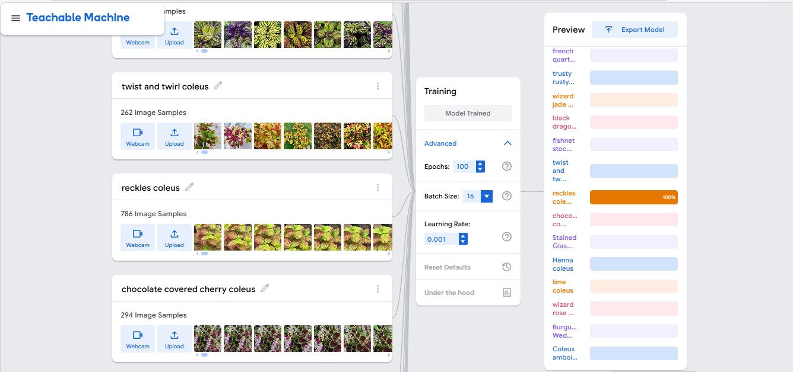 
      ✅ Predicted: Reckless Coleus | Confidence: 100%
    </td>
    <td align="center" width="50%">
      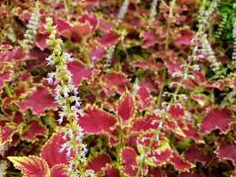 
      <b>Test 12 — Chocolate Covered Cherry</b> 
      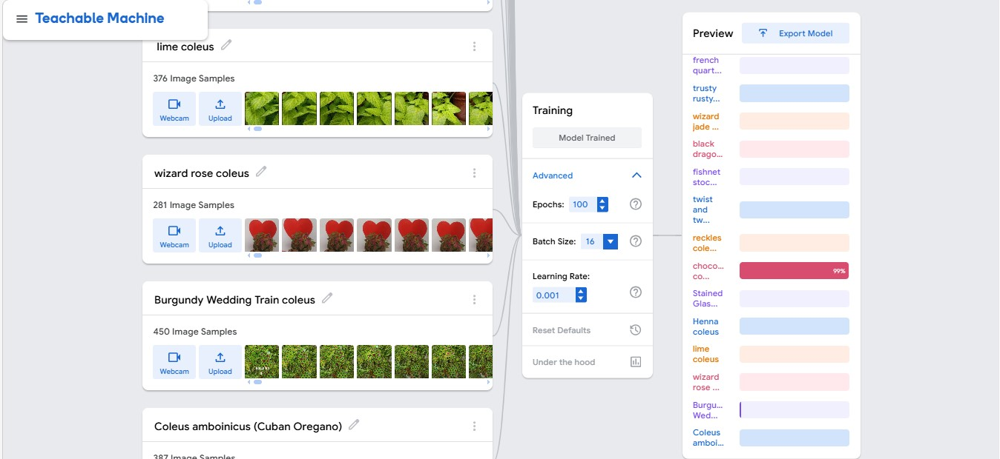 
      ✅ Predicted: Chocolate Covered Cherry | Confidence: 99%
    </td>
  </tr>
  <tr>
    <td align="center" width="50%">
      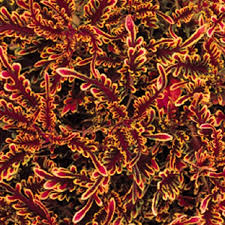 
      <b>Test 13 — Stained Glassworks Kiwi</b> 
      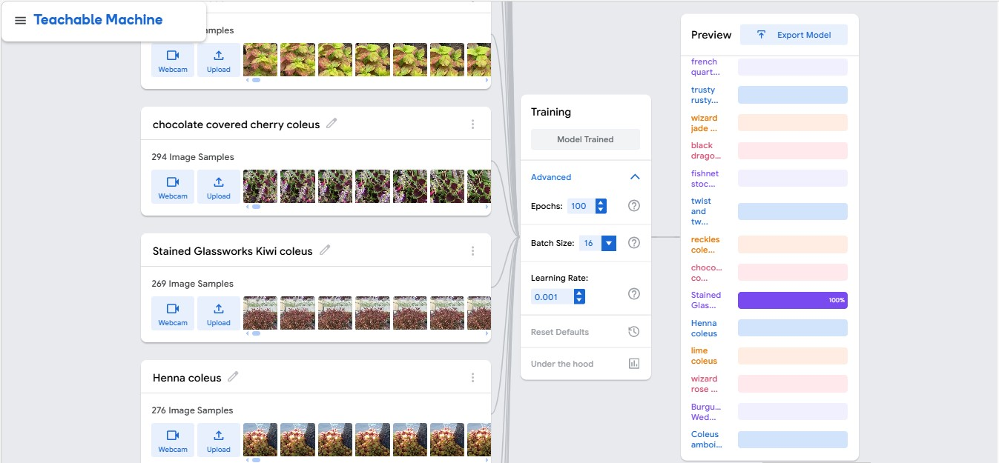 
      ✅ Predicted: Stained Glassworks Kiwi | Confidence: 100%
    </td>
    <td align="center" width="50%">
      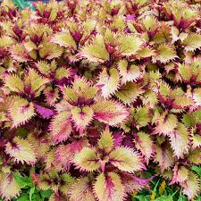 
      <b>Test 14 — Henna Coleus</b> 
      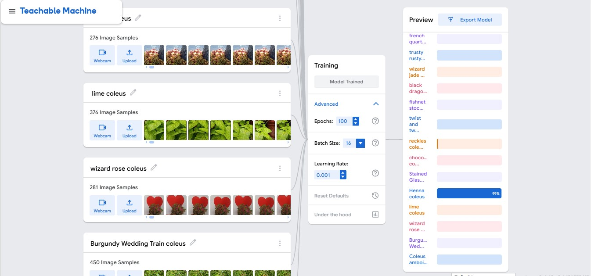 
      ✅ Predicted: Henna Coleus | Confidence: 99%
    </td>
  </tr>
  <tr>
    <td align="center" width="50%">
       
      <b>Test 15 — Lime Coleus</b> 
      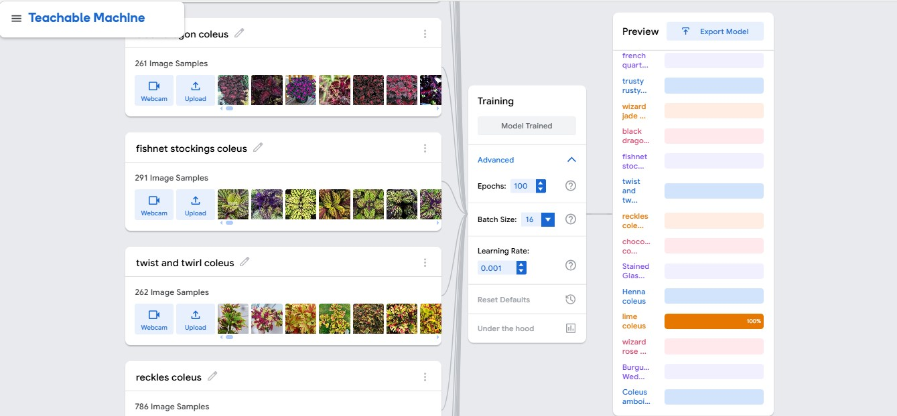 
      ✅ Predicted: Lime Coleus | Confidence: 100%
    </td>
    <td align="center" width="50%">
      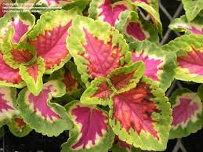 
      <b>Test 16 — Wizard Rose Coleus</b> 
      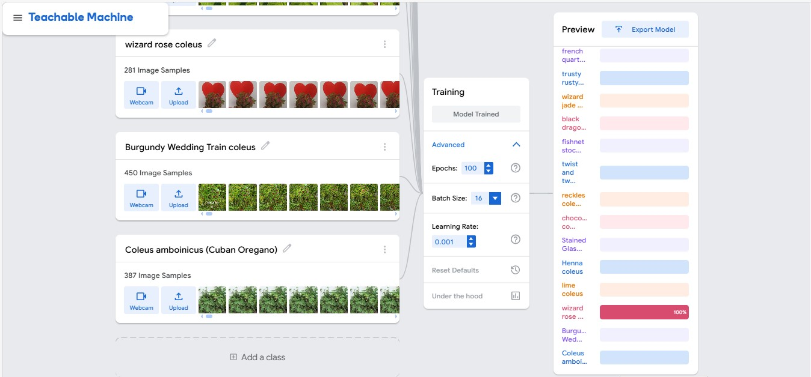 
      ✅ Predicted: Wizard Rose Coleus | Confidence: 100%
    </td>
  </tr>
  <tr>
    <td align="center" width="50%">
      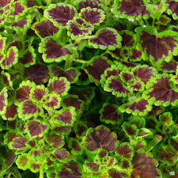 
      <b>Test 17 — Burgundy Wedding Train</b> 
      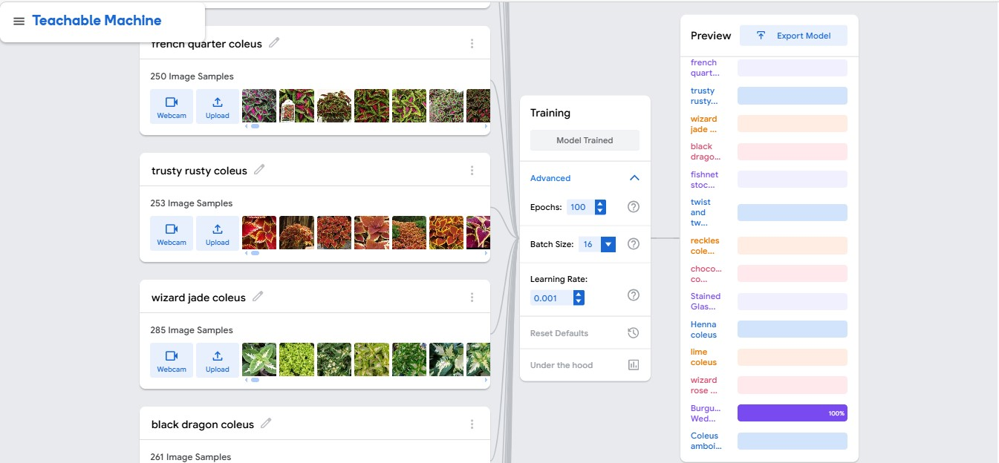 
      ✅ Predicted: Burgundy Wedding Train | Confidence: 100%
    </td>
    <td align="center" width="50%">
      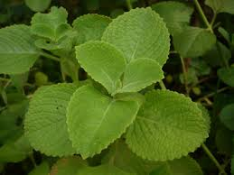 
      <b>Test 18 — Cuban Oregano</b> 
       
      ✅ Predicted: Coleus amboinicus | Confidence: 100%
    </td>
  </tr>
</table>
